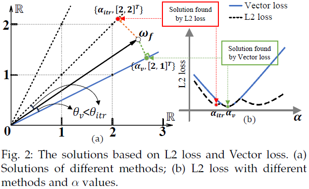

# VecQ: Minimal Loss DNN Model Compression With Vectorized Weight Quantization
# Introduce
> Quantization has been proven to be an effective method for reducing the computing and/or storage cost of DNNs. However, the trade-off between the quantization bitwidth and final accuracy is complex and non-convex, which makes it difficult to be optimized directly. Minimizing direct quantization loss (DQL) of the coefficient data is an effective local optimization method, but previous works often neglect the accurate control of the DQL, resulting in a higher loss of the final DNN model accuracy. In this paper, we propose a novel metric called Vector Loss. Based on this new metric, we develop a new quantization solution called VecQ, which can guarantee minimal direct quantization loss and better model accuracy. In addition, in order to speed up the proposed quantization process during model training, we accelerate the quantization process with a parameterized probability estimation method and template-based derivation calculation. We evaluate our proposed algorithm on MNIST, CIFAR, ImageNet, IMDB movie review and THUCNews text data sets with numerical DNN models. The results demonstrate that our proposed quantization solution is more accurate and effective than the state-of-the-art approaches yet with more flexible bitwidth support. Moreover, the evaluation of our quantized models on Saliency Object Detection (SOD) tasks maintains comparable feature extraction quality with up to 16x weight size reduction.




# Installation
### Libraries
- [Tebsorflow](https://github.com/tensorflow/tensorflow) v 1.13.1
- [Keras](https://github.com/keras-team/keras) v 2.2.4

### Commands
We recommend using Anaconda (Python 3.7) to configure the running environment.
```
conda install jupyter matplotlib tensorflow-gpu==1.13.1 keras==2.2.4
git clone https://github.com/GongCheng1919/VecQ.git
cd VecQ
jupyter-lab
```
# Demo
Please find the demo of [VecQ](./Demo.ipynb) (more demos can be found in [examples](./examples)) and open the Demo file on the opened browser web page.

# Citation
Please cite our work in your publications if it helps your research:
```
@article{cheng2019uL2Q,
  title={$\mu$L2Q: An Ultra-Low Loss Quantization Method for DNN},
  author={Cheng, Gong and Ye, Lu and Tao, Li and Xiaofan, Zhang and Cong, Hao and Deming, Chen and Yao, Chen},
  journal={The 2019 International Joint Conference on Neural Networks (IJCNN)},
  year={2019}
}
```


This framework also supports the uL2Q quantization method in Keras, where the original framework is designed with Caffe.
The examples/vgg-like/uL2Q_demo.ipynb show the details to adopt it.
Please cite our work in your publication if it helps:
```
@article{cheng2020VecQ,
  title={{VecQ}: Minimal Loss DNN Model Compression With Vectorized Weight Quantization},
  author={Cheng, Gong and Yao, Chen and Ye, Lu and Tao, Li and Cong, Hao and Deming, Chen},
  journal={IEEE Transactions on Computers},
  year={2020}
}
```
